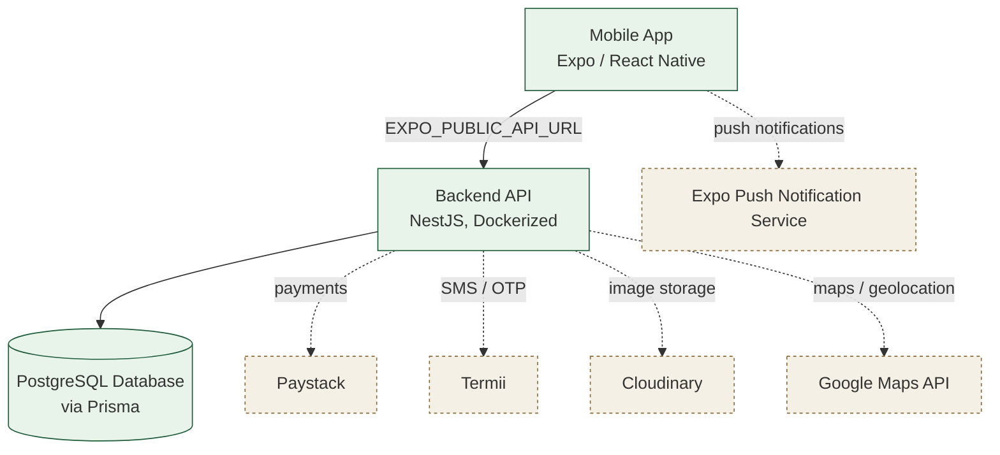

# DG-LETS Agri Market — Phase 1: Infrastructure Discovery & Assessment

> **Document type:** Discovery & Assessment only. No infrastructure has been implemented, no Terraform has been written, and nothing has been deployed as part of this exercise. Findings below are based strictly on what exists in the repository at the time of review; anything not confirmed in code or config is explicitly labeled as unverified.

---

## 1. Executive Summary

DG-LETS Agri Market is a Nigerian agricultural marketplace platform connecting seven user roles — Farmer, Buyer, Trader, Aggregator, Processor, Exporter, and Haulage (logistics) provider — through a mobile app backed by a REST API and a PostgreSQL database, alongside a static marketing landing page.

This review investigated the repository's mobile client configuration, backend build and deployment files, database schema and migration state, CI/CD presence, environment/secrets structure, and available documentation, in order to establish a factual picture of the current infrastructure — not to design or recommend a target architecture yet.

**Overall state discovered:** The application is functionally built (backend modules and mobile screens are largely complete per the project's own spec tracker), but its infrastructure story is **incomplete and internally inconsistent**. Three different hosting configurations exist for the backend (Koyeb, Railway, and a Render URL referenced by the mobile build config), no CI/CD pipeline exists, and no tracked database migrations exist despite a production-shaped Docker setup. No deployment documentation, monitoring, or backup configuration was found in the repository. This assessment exists to make those gaps explicit before any infrastructure design work begins.

---

## 2. Project/Application Architecture

| Layer | Technology | Notes |
|---|---|---|
| Mobile application | Expo / React Native 0.74, TypeScript | Navigation via React Navigation, state via Zustand, server state via TanStack React Query, forms via React Hook Form + Zod |
| Backend | NestJS 10 (Node.js) | Modular structure: auth, users, marketplace, categories, orders, payments, notifications, upload, sms, fees, haulage, messages |
| Database | PostgreSQL, accessed via Prisma ORM 5 | Schema defines identity, marketplace, orders, payments, messaging, haulage, and fee models |
| Authentication | JWT (access + refresh tokens), Passport (local + JWT strategies), OTP phone verification | bcrypt for password hashing |
| Payments | Paystack (primary, integrated in code); Flutterwave (env vars present, integration not confirmed in code reviewed) | Platform transaction fee (2.05%) and role-based registration fees configured |
| SMS / OTP | Termii (Nigeria-focused SMS provider) | Used for phone verification and password reset |
| Image storage | Cloudinary | Env vars present; upload module handles multipart image upload |
| Maps | Google Maps API | Env var present; "Smart Map" mobile screen is a stub, not fully implemented |
| Push notifications | Expo push notification service | Mobile app registers push tokens; server-side send-on-event logic not confirmed as implemented |
| Other integrations | OpenAI (env var present, Phase 3 roadmap item — "AI Agricultural Assistant" — not yet built) | Google Apps Script + Google Sheets used only for the marketing landing page's early-access signup form, unrelated to the core app |

---

## 3. Current Architecture Diagram

**Legend:**
- **Solid boxes / solid lines** = application components under direct project control (mobile app, backend, database).
- **Dashed boxes / dashed lines** = external third-party services the backend or mobile app depends on.

---

## 4. Current Hosting/Deployment Assessment

The repository contains **three separate, non-aligned deployment configurations** for the backend:

| Config file | Target platform | What it configures |
|---|---|---|
| `backend/koyeb.yaml` | Koyeb | Full service definition — Docker build from `backend/Dockerfile`, port 3000, non-secret env vars inlined, start command `npx prisma migrate deploy && node dist/main` |
| `backend/railway.json` | Railway | Minimal — Dockerfile-based build, restart-on-failure policy (max 3 retries); no env vars or start command override defined here |
| `backend/.env.production` | Railway (by its own header comment) | States explicitly: *"These values are set as Railway environment variables"*; contains `REPLACE_IN_RAILWAY_DASHBOARD` placeholders |
| `mobile/eas.json` | Render (inferred) | The mobile app's `preview` and `production` EAS build profiles both set `EXPO_PUBLIC_API_URL` to `https://dglets-agri-backend.onrender.com/api/v1` |

**Assessment:** The mobile build configuration is the only artifact that reflects where a real, shipped app would actually send its traffic — and it points to Render, not Koyeb or Railway. This suggests Render is the most likely candidate for "what the app currently uses," but this is an **inference from configuration, not a confirmed fact**. The repository does not clearly establish Koyeb or Railway as ever having been the active production host, and it should not be assumed that the Render URL is definitely live, currently serving traffic, or configured with the correct secrets. **Independent verification (e.g., an HTTP request to the Render URL, or direct confirmation from whoever manages hosting) is required before treating any of these three as "the" production backend.**

---

## 5. Backend Deployment Configuration

**`backend/Dockerfile`** — multi-stage build:
1. **Builder stage** (`node:20-alpine`): installs full dependencies (`npm install --legacy-peer-deps`), copies source, runs `npx prisma generate`, then `npx nest build`.
2. **Production stage** (`node:20-alpine`): installs production-only dependencies (`npm install --omit=dev --legacy-peer-deps`), copies the built `dist/` output, the generated Prisma client (`.prisma`, `@prisma`), and the `prisma/` schema folder. Exposes port 3000.
3. **Start command:** `npx prisma migrate deploy && node dist/main` — this is a reasonable production pattern in principle (apply migrations, then start the server).

**`backend/startup.sh`** — a separate shell script that is **not referenced anywhere else in the repository** (not called by the Dockerfile, `koyeb.yaml`, or `railway.json`). It appears to be an unused artifact from an earlier setup approach. Its logic:
- Runs `npx prisma db push --accept-data-loss` in a retry loop (up to 5 attempts, 10s apart), continuing to start the server even if the push fails.
- Then runs `npx prisma generate`.
- Then starts the server with `node dist/main`.

**`prisma migrate deploy` vs. `prisma db push` — why the difference matters:**
- `prisma migrate deploy` applies a set of pre-generated, version-controlled migration files (SQL) to the database in order. It is designed for production: it is deterministic, auditable, and reversible in principle because each change is a discrete, reviewed file.
- `prisma db push` compares the current Prisma schema directly against the live database and force-syncs the database to match — with no migration history, no audit trail, and no rollback path. It is intended for early prototyping, not production.
- The `--accept-data-loss` flag explicitly tells Prisma to proceed even if the sync would destroy existing data (e.g., dropping a column that no longer matches the schema) — **this is a materially dangerous flag to have anywhere near a production startup path**, because it can silently discard live data with no confirmation step and no way to review what was lost.

**Risk identified:** The Dockerfile's real start command (`prisma migrate deploy`) is the safer of the two approaches, but it depends entirely on migration files existing — and, as documented in Section 6, none exist in this repository. If `startup.sh` were ever wired into an actual deployment (it currently is not, per the config files reviewed), it would introduce a genuine production data-loss risk.

---

## 6. Database Assessment

- **Engine:** PostgreSQL (confirmed via `datasource db { provider = "postgresql" }` in `backend/prisma/schema.prisma`).
- **ORM:** Prisma 5.
- **Main production-relevant models:** `User` (with 8 roles: FARMER, BUYER, TRADER, AGGREGATOR, PROCESSOR, EXPORTER, HAULAGE, ADMIN), `FarmerProfile`, `BuyerProfile`, `HaulageProfile`, `OtpToken`, `RefreshToken`, `Category`, `Product`, `Order`/`OrderItem`, `Payment`, `Notification`, `Review`, `RewardWallet`, `SavedProduct`, `Verification`, `HaulageJob`/`HaulageApplication`, `PlatformFee`, `AuditLog`, `MarketPrice`.
- **Migration files:** `backend/prisma/migrations/` **does not exist in the repository at all** — there are zero tracked migration files of any kind.
- **Implication:** With no migration history, there is no version-controlled, auditable record of how the current (or any future) database schema was reached. This means:
- `prisma migrate deploy` (the Dockerfile's actual start command) would have nothing to apply, and would not create the schema on a fresh database.
- Any database currently in use was most likely created via `prisma db push` (manually or via the unused `startup.sh`) rather than through tracked migrations — consistent with SPEC.md's own notes that newer models (Haulage, PlatformFee) "need migration."
- Future schema changes have no safe, repeatable, reviewable path without first establishing a proper migration baseline. This is a foundational gap that should be resolved before any further schema changes are made in a shared or production environment.

---

## 7. CI/CD Assessment

**No `.github/workflows/` directory exists anywhere in the repository.** No GitHub Actions workflows — or any other CI/CD pipeline definitions — were found.

**Consequences of this gap:**
- **No automated testing:** Even though Jest is configured (`backend/package.json` includes a full Jest setup), there is no evidence it is run automatically on any code change.
- **No automated build verification:** Nothing confirms that `npx nest build` or the mobile app's build succeeds before code is merged or deployed.
- **No automated Docker build:** The Dockerfile is never built in an automated pipeline as far as the repository shows — it would need to be built manually or triggered by a hosting provider's own git-integration (e.g., Koyeb/Railway can build directly from a connected repo, but this is a platform feature, not a repository-defined CI/CD process).
- **No automated deployment:** There is no defined, repeatable process for getting a code change from a commit into a running environment.
- **Net effect:** The project is currently entirely dependent on manual steps for testing, building, and deploying — increasing the chance of human error, inconsistent environments, and undetected regressions reaching users.

---

## 8. Configuration and Secrets

The following categories of environment variables are required, based on `.env.example` and `.env.production` (no real secret values are reproduced here):

| Category | Variables (names only) |
|---|---|
| App | `NODE_ENV`, `PORT`, `API_PREFIX`, `CORS_ORIGIN` |
| Database | `DATABASE_URL` |
| JWT / Auth | `JWT_SECRET`, `JWT_EXPIRES_IN`, `JWT_REFRESH_SECRET`, `JWT_REFRESH_EXPIRES_IN`, `OTP_EXPIRES_MINUTES`, `BCRYPT_ROUNDS` |
| SMS (Termii) | `TERMII_API_KEY`, `TERMII_SENDER_ID`, `TERMII_BASE_URL` |
| Payments | `PAYSTACK_SECRET_KEY`, `PAYSTACK_PUBLIC_KEY`, `PAYSTACK_CALLBACK_URL`, `FLUTTERWAVE_SECRET_KEY`, `FLUTTERWAVE_PUBLIC_KEY` |
| Image storage (Cloudinary) | `CLOUDINARY_CLOUD_NAME`, `CLOUDINARY_API_KEY`, `CLOUDINARY_API_SECRET` |
| Maps | `GOOGLE_MAPS_API_KEY` |
| AI (Phase 3, unused currently) | `OPENAI_API_KEY` |
| Fees | `PLATFORM_FEE_RATE`, `PLATFORM_FEE_MIN`, `PLATFORM_FEE_CAP`, `REGISTRATION_FEE_FARMER`, `REGISTRATION_FEE_TRADER`, `REGISTRATION_FEE_AGGREGATOR`, `REGISTRATION_FEE_PROCESSOR`, `REGISTRATION_FEE_EXPORTER`, `REGISTRATION_FEE_HAULAGE`, `REGISTRATION_FEE_BUYER`, `HAULAGE_COMMISSION_RATE` |
| Rewards | `REWARD_TOKEN_NAME`, `REWARD_SIGNUP_AMOUNT`, `REWARD_ORDER_COMPLETE_AMOUNT`, `REWARD_REVIEW_AMOUNT`, `REWARD_REFERRAL_AMOUNT` |
| Admin | `ADMIN_EMAIL` |
| Mobile | `EXPO_PUBLIC_API_URL` |

**Note:** `backend/.env.production` and `backend/koyeb.yaml` contain **placeholder values only** (e.g., `REPLACE_IN_RAILWAY_DASHBOARD`) for all sensitive keys — no live secrets are present in the repository. This is correct practice and should remain the standard going forward: production secrets should never be committed to git, and should instead live in the hosting provider's own secrets/environment management, or a dedicated secrets manager.

---

## 9. Security Assessment

| Area | Finding | Status |
|---|---|---|
| CORS | `app.enableCors({ origin: CORS_ORIGIN env var, default '*' })` in `main.ts`; `koyeb.yaml` explicitly sets `CORS_ORIGIN: "*"` for its "production" env block | **Confirmed** — currently wide open unless overridden at deploy time |
| JWT authentication | Access + refresh token pattern via `@nestjs/jwt` and Passport strategies; mobile client auto-refreshes on 401 | **Confirmed** in code |
| Password hashing | bcrypt, configurable rounds (`BCRYPT_ROUNDS`, default 12 in code) | **Confirmed** in code |
| Rate limiting | `ThrottlerModule` is configured in `app.module.ts` with three tiers (10/sec, 50/10sec, 100/min) | **Configuration confirmed; enforcement not confirmed** — no global `ThrottlerGuard` registration was observed in the files reviewed. Whether individual controllers apply `@UseGuards(ThrottlerGuard)` requires further inspection before assuming rate limiting is actually active on any given endpoint |
| Input validation | Global `ValidationPipe` with `whitelist`, `forbidNonWhitelisted`, `transform` enabled in `main.ts` | **Confirmed** in code |
| HTTPS | Not configured at the application level (expected — normally terminated by the hosting platform, e.g., Render's default HTTPS) | **Unverified** — depends on whichever host is actually in use and its default configuration |
| Secrets management | No real secrets found committed to the repository; `.env.production`/`koyeb.yaml` use placeholders | **Confirmed** as good practice in the repo itself, but where secrets are *actually* stored today (which dashboard, which environment) is **unverified** |
| Database exposure | `DATABASE_URL` format and reachability (public vs. private networking) is not defined in any repository file | **Unverified** |
| Container security | Dockerfile uses official `node:20-alpine` base images and a multi-stage build (reduces final image surface); no explicit non-root user, no image scanning step observed | **Partially confirmed** — base image and multi-stage practice are good; no evidence of hardening beyond that |
| Dependency / security scanning | No `npm audit`, Dependabot config, Snyk, or similar tooling found in the repository | **Confirmed absent** |

---

## 10. Monitoring, Logging and Backup Assessment

| Capability | Found in repository? |
|---|---|
| Application performance monitoring (e.g., APM tooling) | Not found |
| Infrastructure monitoring | Not found |
| Error tracking (e.g., Sentry) | Not found |
| Centralized/structured logging | Not found — only default `console.log` statements observed in `main.ts` |
| Health check endpoint | Not found in the modules reviewed |
| Database backups | Not found — no backup scripts, cron jobs, or provider-specific backup configuration in the repository |
| Disaster recovery documentation | Not found |

**Important caveat:** The absence of these items *in the repository* does not necessarily mean they are entirely absent in practice — a hosting provider (e.g., Render's managed PostgreSQL) may apply its own default backup policy, and it is possible monitoring exists outside version control (e.g., configured directly in a provider dashboard). However, **none of this should be assumed to exist or to be adequate until it is explicitly verified** with whoever manages the current hosting accounts.

---

## 11. Current Infrastructure Gaps

| Finding | Current State | Risk/Impact | Recommended Direction |
|---|---|---|---|
| Conflicting hosting configurations | Koyeb, Railway, and Render (via mobile build config) all referenced | Unclear which environment is authoritative; risk of deploying to or debugging the wrong target | Confirm with stakeholders which host (if any) is actually live before further work |
| No CI/CD pipeline | No `.github/workflows/` or equivalent | Manual build/test/deploy increases error risk and slows iteration | Establish a pipeline once the target host is confirmed |
| No tracked Prisma migrations | `prisma/migrations/` absent | No safe, auditable path to evolve schema; Docker's `migrate deploy` command has nothing to apply | Establish a migration baseline against the current live database before making further schema changes |
| No documented deployment process | No README, no DEPLOYMENT.md | New team members or engineers cannot reliably reproduce a deployment | Author deployment documentation once the process is confirmed and stabilized |
| No monitoring evidence | No APM, error tracking, or logging tooling found | Issues in production may go undetected until users report them | Introduce monitoring/error-tracking as part of infrastructure design |
| No documented backup/recovery process | No backup scripts or DR documentation found | Risk of unrecoverable data loss in a failure scenario | Confirm and document actual backup coverage of whatever database host is in use |
| No clear production secrets-management process | Secrets are placeholders in-repo; actual storage location unverified | Risk of secret sprawl, inconsistent rotation, or accidental exposure | Confirm and document current secrets storage; consider a dedicated secrets manager |
| No custom API domain identified | Only a default provider subdomain (e.g., `onrender.com`) found | Vendor lock-in appearance; less professional/stable public-facing URL | Decide on and provision a custom domain as part of infrastructure design |
| Rate limiting enforcement unverified | `ThrottlerModule` configured but global guard registration not confirmed | Endpoints may be more exposed to abuse than assumed | Verify guard application across controllers |
| No dependency/security scanning | No audit tooling found | Vulnerable dependencies could go unnoticed | Introduce scanning as part of CI/CD once established |

---

## 12. Production Infrastructure Requirements

Based on the application's architecture, the following infrastructure *capabilities* will be needed (this section identifies needs only — it does not select a specific cloud provider, since the evidence gathered so far is not sufficient to justify one over another):

- **Backend compute/container hosting** capable of running the existing Docker image.
- **Managed PostgreSQL** (or self-managed equivalent) with defined backup policy.
- **Networking** — clear rules for what is publicly reachable (API) versus private (database).
- **HTTPS/domain** — a stable, properly certificated public endpoint, ideally on a custom domain.
- **Secrets management** — a defined, single source of truth for production secrets (provider-native or dedicated tool).
- **Container/image management** — a registry and versioning strategy for built Docker images.
- **CI/CD** — automated build, test, and deployment pipeline.
- **Monitoring/logging** — application error tracking and centralized logs at minimum.
- **Backups** — confirmed, tested database backup process.
- **Disaster recovery** — a documented plan for restoring service after a failure.
- **Security controls** — confirmed CORS policy, active rate limiting, dependency scanning, and container hardening.

---

## 13. Current State vs Target State

| Current State | Required/Target State |
|---|---|
| Three conflicting hosting configs (Koyeb, Railway, Render-inferred) | One confirmed, documented production host |
| No CI/CD | Automated build, test, and deploy pipeline |
| No tracked database migrations | Full migration history with a safe deploy process (`migrate deploy`, not `db push`) |
| No deployment documentation | Written, repeatable deployment runbook |
| `CORS_ORIGIN: "*"` in production config | Explicit, restricted CORS origin list |
| Rate limiting configured but unverified as enforced | Confirmed, tested rate limiting on public endpoints |
| No monitoring or error tracking | Application monitoring and error tracking in place |
| No confirmed backup process | Documented, tested, and scheduled database backups |
| No disaster recovery plan | Written DR plan with defined recovery objectives |
| No custom domain | Custom domain with managed HTTPS |
| Secrets management location unverified | Documented, single source of truth for production secrets |
| No dependency/security scanning | Automated scanning integrated into CI/CD |

---

## 14. Phase 1 Conclusion

This discovery phase has established a factual baseline of the DG-LETS Agri Market codebase's infrastructure posture: a functionally complete application (per its own internal spec tracker) sitting on top of an **unconfirmed, internally inconsistent hosting setup**, with **no CI/CD**, **no tracked database migrations**, and **no monitoring, backup, or deployment documentation** present in the repository.

What remains to be verified before any infrastructure implementation begins:
- Which hosting provider (if any of Koyeb, Railway, or Render) is actually serving production traffic today.
- Whether the Render URL referenced in `mobile/eas.json` currently responds and is healthy.
- Where production secrets are actually stored and managed today.
- Whether any monitoring, logging, or backup mechanism exists outside of the repository (e.g., configured directly in a hosting dashboard).
- Domain/DNS ownership status, if any.
- The actual current state of the production database schema, to establish an accurate migration baseline.

No infrastructure should be designed or implemented against assumptions in place of these confirmations.

---

## 15. Inputs for Phase 2 — Infrastructure Design

Before Phase 2 (infrastructure design) begins, the following must be confirmed or decided:

- [ ] Confirm the active production hosting provider (independently verify the Render URL, and rule out or rule in Koyeb/Railway).
- [ ] Confirm where the production PostgreSQL database is actually hosted.
- [ ] Confirm domain/DNS ownership status, if any exists.
- [ ] Confirm where production secrets are currently stored and managed.
- [ ] Confirm current production API health (uptime, response correctness).
- [ ] Decide the target infrastructure architecture (hosting provider, compute model).
- [ ] Decide the CI/CD strategy and tooling.
- [ ] Decide the migration strategy for establishing a safe, tracked baseline from the current (untracked) schema state.
- [ ] Decide the monitoring, logging, and error-tracking strategy.
- [ ] Decide the backup and disaster-recovery strategy.
